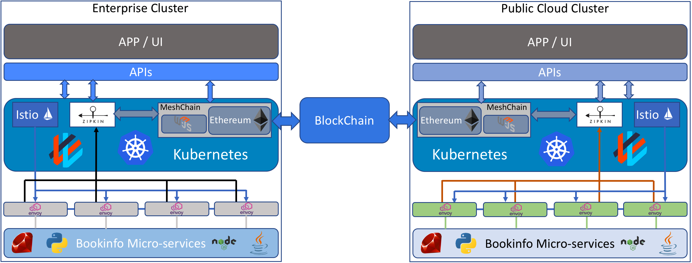

# MeshChain
A service mesh distributed tracing solution by using BlockChain.

# Content
* [Problem](#problem)
* [Solution](#solution)
* [Architecture](#architecture)
* [Advantages](#advantages)
* [Installation](#installation)
* [Cisco product Opportunities](#cisco-product-opportunities)

# Problem
In a multi-cloud environment, observability is important between hybrid cloud parties for troubleshooting, optimization, and analytics. Applications are broken down into micro-services, in which could be deployed on multiple hybrid cloud networks. Each party needs a way to verify that the applications deployed on the other party are running smoothly. Moreover, this verification data should be shared between the environments in an immutable storage.

# Solution
MeshChain: is a solution for managing, sharing, and storing service mesh distributed tracing information using open source tools and BlockChain.
* Open source tools used:
  1. [Kubernetes](https://kubernetes.io/): is a system used to automate the deployment, scaling and managing containerized applications. 
  2. [WeaveWorks](https://www.weave.works/): A Kubernetes network plug-in for networing between containers. 
  3. [Istio](https://istio.io/): provides security, managing and deploying sidecar proxies, and telemetry. 
  4. [Envoy](https://www.envoyproxy.io/): is a proxy mounted to a micro-service, so that only allowed connections are established and it’s also called sidecars.
  5. [Zipkin](https://zipkin.io/): is a tracking tool used to have a tracing record for every request that runs within the cluster.
  6. [Ethereum](https://ethereum.org/): is BlockChain based immutable distributed ledger. 
  7. [Web3.js](https://github.com/ethereum/web3.js/): is the Ethereum compatible JavaScript APIs, that allows to interact with the Ethereum node. 

# Architecture

* In this project I've used four VMs running Ubuntu 16.04: two Enterprise (master & worker), and two Public cloud (master & worker).
* The system consists of two separate Kubernetes clusters.
* Kubernetes is responsible for creating and managing the micro-services within the cluster.
* Each cluster has its own Istio and applications (micro-services).
* Istio will configure the Envoy proxies (sidecars) for the micro-services.
* Each Istio has a separate tracing tool (Zipkin) to track the requests through the cluster via monitoring the sidecars.
* After getting the tracing record from Zipkin, web3 agent will write the tracing file to the blockchain.

# Advantages
1. Provide an application function consensus in a hybrid cloud environments, by having a tracing record of the procedure that the micro-services went through in the environment.
2. The ability to split the applications between enterprises and/or public clouds and have the records for the procedures that the applications run through.
3. Compliments existing cloud-native telemetry, log and tracing tools.
4. Platform for distributed Cloud-Native observability in a multicloud environment.

# Installation
Clone this repo
```
git clone https://cto-github.cisco.com/aalzugha/MeshChain.git
```
#### 1. Install Kubernetes & WeavNet plug-in by following [Kubernetes Installation guide][1], or follow these steps.

> You have to install Kubernetes on all the machines (VMs/instances) used in the environment

Installing Docker
```
sudo su
apt-get update
apt-get install -y docker.io
```
> **IMPORTANT!!** If you have proxies on your VMs you need to configure the proxies in docker by following [this link](https://docs.docker.com/config/daemon/systemd/) under the HTTP/HTTPS section.

If your system uses proxies, you need to inject the proxies to docker. I'm using Cisco's CTAO lab, and these are the steps to do it
```
mkdir -p /etc/systemd/system/docker.service.d
vim /etc/systemd/system/docker.service.d/http-proxy.conf
```
Inset the next lines in the above .conf file
```
[Service]
Environment="HTTP_PROXY=http://proxy-wsa.esl.cisco.com:80" "http_proxy=http://proxy-wsa.esl.cisco.com:80" "https_proxy=http://proxy-wsa.esl.cisco.com:80" "HTTPS_PROXY=http://proxy-wsa.esl.cisco.com:80" "FTP_PROXY=http://proxy-wsa.esl.cisco.com:80" "ftp_proxy=http://proxy-wsa.esl.cisco.com:80"
```
Restart Docker
```
systemctl daemon-reload
systemctl restart docker
```
Installing kubelet, kubectl, and kubeadm

```
apt-get update && apt-get install -y apt-transport-https curl

curl -s https://packages.cloud.google.com/apt/doc/apt-key.gpg | apt-key add -
cat <<EOF >/etc/apt/sources.list.d/kubernetes.list
deb http://apt.kubernetes.io/ kubernetes-xenial main
EOF

apt-get update
apt-get install -y kubelet kubeadm kubectl
```
> To install a specific version of K8s run ```apt-get install -y kubelet=<vserion> kubeadm=<vserion> kubectl=<vserion>```


* After intstall Kubernetes, you need to set it up.

If the interface you use for Kubernetes management traffic (for example, the
IP address used for `kubeadm join`) is not the one that contains the default
route out of the host, you need to specify the management node IP address in
the Kubelet config file. Add the following line to
(`/etc/systemd/system/kubelet.service.d/10-kubeadm.conf`):
```
Environment="KUBELET_EXTRA_ARGS=--fail-swap-on=false --feature-gates HugePages=false --node-ip=<node-management-ip-address>"
```
> For Example:
if the VMs IP is 10.10.10.10 the above line would be like 
```
Environment="KUBELET_EXTRA_ARGS=--fail-swap-on=false --feature-gates HugePages=false --node-ip=10.10.10.10"
```
Restart kubelet:
```
systemctl daemon-reload
systemctl restart kubelet
```
initialize the master node by running the following code **NOT as a root**
> change the IP address accordingly
```
sudo swapoff -a
sudo kubeadm init --token-ttl 0 --apiserver-advertise-address=10.10.10.10
```
If you ran into errors while running kubeadm command, just use the following steps to reset kubeadm and do kubeadm init again
```
rm -rf $HOME/.kube
sudo kubeadm reset
```
After initializing the master run the following commands
```
mkdir -p $HOME/.kube
sudo cp -i /etc/kubernetes/admin.conf $HOME/.kube/config
sudo chown $(id -u):$(id -g) $HOME/.kube/config
```
Then add the K8s network plug-in (I choose WeaveNet for MeshChain)
```
kubectl apply -f "https://cloud.weave.works/k8s/net?k8s-version=$(kubectl version | base64 | tr -d '\n')"
```
After running the command ```kubeadm init ...``` , you will have a command to join the worker nodes. it looks like this
> Run this command if you ran into swap issue ```sudo swapoff -a```
```
kubeadm join 10.10.10.10:6443 --token <token> --discovery-token-ca-cert-hash sha256:<hash>
```
After joining the workers to the master, run this command on the master to check if node are connected or not
```
kubectl get node
```
The output should be similar to this
```
NAME             STATUS    ROLES     AGE       VERSION
mcEnterprise1    Ready     master    10m       v1.10.4
mcEnterprise2    Ready     <none>    2m        v1.10.4
```
> If you want to have kubectl autocompele add this line in .bashrc ``` source <(kubectl completion bash) ```, then reboot the master
Do the same installing process for the other cluser (public cloud), and you should have similar output to this
```
NAME               STATUS    ROLES     AGE       VERSION
mcPublicCloud1     Ready     master    4m        v1.10.4
mcPublicCloud2     Ready     <none>    2m        v1.10.4
```
#### 2. Installing Istio, in this project, I used Istio 0.7.1. 
> Do the same process in the master of the other cluster
Download Istio files by running this
```
wget https://github.com/istio/istio/releases/download/0.7.1/istio-0.7.1-linux.tar.gz
tar -xzf istio-0.7.1-linux.tar.gz 
rm istio-0.7.1-linux.tar.gz 
```
Start installing Istio
```
cd istio-0.7.1
export PATH=$PWD/bin:$PATH
cd ..
```
By default, your cluster will not schedule pods on the master for security reasons. If you want to be able to schedule pods on the master, e.g. for a single-machine Kubernetes cluster for development, run:
```
kubectl taint nodes --all node-role.kubernetes.io/master-
kubectl label node <master-node-name> master=app
# For example node name mcEnterprise1
```
Apply Istio to kubernetes
```
kubectl apply -f MeshChain/K8s/istio.yaml
```
Istio elements will be deployed in the master node.

Just to check if istio elements are running, on both clusters run the following
```
kubectl get pods -n istio-system -owide
```
the output should be similar to this
```
NAME                             READY     STATUS    RESTARTS   AGE       IP          NODE
istio-ca-77d7fb5cb9-4snrr        1/1       Running   0          3m        10.32.0.7   mcPublicCloud1
istio-ingress-5c879987bf-j6n7z   1/1       Running   0          3m        10.32.0.5   mcPublicCloud1
istio-mixer-d8b98df8f-4mnsv      3/3       Running   0          3m        10.32.0.4   mcPublicCloud1
istio-pilot-74f45f5796-hj8nj     2/2       Running   0          3m        10.32.0.6   mcPublicCloud1
```
Edit Meshchain/K8s/bookinfo.yaml from the repo and change the ```<cluster-name>``` to your cluster name, then run
> To search and replace all in vim, use ```:%s/<cluster-name>/your-cluster's-name/g```
```
kubectl create namespace bookinfo
kubectl create -f <(istioctl kube-inject -f MeshChain/K8s/bookinfo.yaml)
```
Check it the pods are running with the sidecars
```
kubectl get pods -n bookinfo -owide
```
the output should be similar to this
```
NAME                                  READY     STATUS    RESTARTS   AGE       IP          NODE
ent-details-v1-7bc7c59c8c-m7z8s       2/2       Running   0          1m        10.44.0.2   mcEnterprise2
ent-productpage-v1-7c685d5cc9-spcpb   2/2       Running   0          1m        10.44.0.5   mcEnterprise2
ent-ratings-v1-595bdd8c8c-2qphz       2/2       Running   0          1m        10.44.0.1   mcEnterprise2
ent-reviews-v1-b6f5b6bc5-fnjmh        2/2       Running   0          1m        10.44.0.3   mcEnterprise2
ent-reviews-v2-b7db5b9f-rbgr9         2/2       Running   0          1m        10.32.0.8   mcEnterprise1
ent-reviews-v3-57c8bfbff9-jsznm       2/2       Running   0          1m        10.44.0.4   mcEnterprise2
```
> Under the column READY it shows 2/2 which means this pods has two containers running (the micro-service and the sidecar)

To access the application that we just installed in the cluster, you need to get the port number that ```istio-ingress-5c879987bf-j6n7z``` is exposed on. Run the following
```
kubectl get service -n istio-system 
```
the output should be similar to the this
```
NAME            TYPE           CLUSTER-IP       EXTERNAL-IP   PORT(S)                                                             AGE
istio-ingress   LoadBalancer   10.106.59.14     <pending>     80:31515/TCP,443:30128/TCP                                          2d
istio-mixer     ClusterIP      10.109.110.193   <none>        9091/TCP,15004/TCP,9093/TCP,9094/TCP,9102/TCP,9125/UDP,42422/TCP    2d
istio-pilot     ClusterIP      10.101.116.201   <none>        15003/TCP,15005/TCP,15007/TCP,15010/TCP,8080/TCP,9093/TCP,443/TCP   2d
```
As you can see right here that the ```istio-ingress``` serivce is exposed on ```31515``` for the enterprise cluster. Open a web browser and call the following IP address ```<The-Master's-IP>:31515/productpage``` to access the application. Do the same procedure to get the other cluster's port number. You will need the IP address and the port number to initiate the traces on each cluster.
>**This part would be used after installing Geth node**


#### 3. Installing Zipkin
Run the following comand to install Zipkin
```
kubectl create namespace blockchain
kubectl apply -f MeshChain/K8s/zipkin.yaml
```
The previous command will create a Zipkin container and expose the port number ```32100``` to access Zipkin from outside the cluster. To access Zipkin's UI, open a web browser and use this IP ```<The-Master's-IP>:32100```

#### 4. Installing and configuring the containerized geth node 
I have already created docker images for two nodes to be installed in each cluster. to have the geth nodes, run the following
> To create your own docker image I have provided the dockerfile so that you can base your images on, but you will need to configure a new genesis file for the blockchain.

Enterprise cluster
```
kubectl apply -f MeshChain/K8s/MC1.yaml 
```
Public cloud cluster
```
kubectl apply -f MeshChain/K8s/MC2.yaml 
```
Then to make sure that the pod is running, run the following
> Ports that are exposed by the containers: ```30001``` for geth, and ```30100``` for the web3.js server

```
kubectl get pods -n blockchain -owide
```
The output should be similar to this
```
NAME                     READY     STATUS    RESTARTS   AGE       IP          NODE
geth-766f8b47db-4vphq    1/1       Running   0          3m        10.44.0.6   mcEnterprise2
zipkin-67c6d7d4c-72zfl   1/1       Running   0          45m       10.32.0.9   mcEnterprise1
```
Now let's access the geth pods and setup the BlockChain
By following the [puppeth tutorial](https://modalduality.org/posts/puppeth), follow these steps

Enterprise cluster
```
kubectl exec -it -n blockchain geth[TAB] bash
cd testnet
../geth --datadir node1 --port 3000 --syncmode "full"
```
```
# On a second console, connect to the geth console
kubectl exec -it -n blockchain geth[TAB] bash
cd testnet
../geth attach ipc:node1/geth.ipc
# Then configure the geth node, to connect the two nodes
personal.unlockAccount(eth.coinbase,"cisco123",100000000)
admin.nodeInfo.enode
# The output would be similar to this "enode://hash@[::]:3000", use that ouptput in the second cluster
# change [::] to the IP of the cluster and 3000 to 30001 so it would be like "enode://hash@<ip-Enterprise>:30001"

# After adding the two nodes you can check if they are added or not, by running the following 
admin.peers
# It should give the info of the other cluster's geth node

# Then start mining on both clusters
miner.start(0)
```
```
# On a third console, start the web3.js server
kubectl exec -it -n blockchain geth[TAB] bash
node app.js
```
Public cloud cluster
```
kubectl exec -it -n blockchain geth[TAB] bash
cd testnet
../geth --datadir node2 --port 3000 --syncmode "full"
```
```
# On a second console, connect to the geth console
../geth attach ipc:node2/geth.ipc
# Then configure the geth node, to connect the two nodes
personal.unlockAccount(eth.coinbase,"cisco123",100000000)
#put the enode info from the other cluster in the following command
admin.addPeer("enode://hash@<ip-Enterprise>:30001")

# After adding the two nodes you can check if they are added or not, by running the following 
admin.peers
# It should give the info of the other cluster's geth node

# Then start mining on both clusters
miner.start(0)
```
```
# On a third console, start the web3.js server
kubectl exec -it -n blockchain geth[TAB] bash
node app.js
```
After starting the two web3.js servers, I have provided a script that will generate traces for you every 30 seconds. You will need to change <Cluster-master's-IP> to your clusters' IP addresses and the port number that you have got from ```istio-ingress```.
```
vim MeshChain/src/initiate_traces.py
```
To run the script, run the following on a seprate console in one of the clusters
```
python MeshChain/src/initiate_traces.py
```
Now you can interact with the BlockChain using the postman collections provided in the repo.

How to use the postman BlochChain APIs:
1. Need to change the ip address for the request to your clusters' ip addresses.
2. The sequence of actions to write to the BlockChain:
* /unlock_coinbase_account
* /create_auditchain
* /zipkin_poll_start
3. To stop writing
* /zipkin_poll_stop
4. To retrieve data from the BlochChain
* /query_trace_data
* /get_all_traces
* /get_all_blocks
* /get_transactions_in_block

And here is a small GUI that we used in the demo. [Meshchain UI][10]

If something goes wrong with the node, simply kill the two pods, and kubernetes will replace them with new ones, by running
```
kubectl delete pod -n blockchain geth[TAB]
```
And start setting up the geth node again.
# Cisco product Opportunities
* Cisco Container Platform.
* Cisco CloudCenter.
* AppDynamics for Kubernetes.
* VPP.


[1]:https://kubernetes.io/docs/tasks/tools/install-kubeadm
[10]:https://cto-github.cisco.com/lubalogh/meshchain-ui
